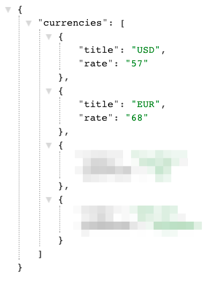

# 19-12-2017

**https://kodaktor.ru/75ef02a**

**http://j.mp/phpkurs2017**

Задания.
---

*Повторение z4a* Работая в своей папке, создайте сценарий, который по переданным ему двум числам a и b возвращает их **сумму**. Он должен быть доступен по адресу вида https://php-study1-gossoudarev.c9users.io/kurs/Ivanova/4a_adder.php?a=5&b=3
* Убедившись, что сценарий правильно работает, сделайте пулл-реквест в этот репозиторий, который содержит файл  вида Ivanova1.txt где находится ссылка на сценарий и его текст.

z5. Напишите сценарий, который заменяет в строке, переданной с помощью параметра txt, все буквы a на звёздочки. Например по входу ananda должно получаться ∗n∗nd∗ и это должно быть в тегах h2. 
Если сценарию не передаётся ничего, он должен возвращать три звёздочки. Используйте функцию str_replace для замены, а функцию header для задания заголовков CORS и Content-Type text/plain https://kodaktor.ru/headers 

z6. 
1. Напишите  сценарий вида https://php-study1-gossoudarev.c9users.io/kurs/Ivanova/6.php, который выдаёт с заголовком CORS документ  JSON с вашими именем и фамилией в виде {firstname: …, lastname: …} и убедитесь, что JSON отображается правильно при использовании инструментов типа JSON Formatter и что кодировка верная. Используйте функцию json_encode для выдачи  JSON, а  функцию header для задания заголовков CORS и Content-Type application/json https://kodaktor.ru/headers 

2. Напишите клиентский сценарий, который обращается к этому адресу и распределяет имя и фамилию по двум «полям» в документе, как показано на скетче:

z6a. Напишите PHP-сценарий, который выдаёт список валют вида:

и напишите JavaScript сценарий по образцу https://kodaktor.ru/logins09012018
который выводит список названий валют извлечённый из указанного выше списка.

Сценарий-образец, который формирует пример простого JSON-документа
называется json1.php и располагается в нашем проекте в папке demo_files

Он доступен по адресу https://php-study1-gossoudarev.c9users.io/demo_files/json1.php
а информацию из него извлекает пример JavaScript-сценария по адресу https://kodaktor.ru/jsonfetch09012018

z6b. Развитие предыдущего задания z6a: Пусть генерируется не список, а красивая таблица вида

можно использовать  готовый список валют https://kodaktor.ru/j/rates

z6c. Развитие предыдущего задания z6a: пусть у нас есть форма, с помощью которой методом POST мы посылаем имя валюты ('GBR' и т.п.) и если оно найдено, то серверный сценарий выдаёт конкретно JSON про эту валюту - её имя и стоимость в рублях,    иначе выдаётся 404 «нет такой валюты». Клиентский сценарий должен вывести полученную информацию в виде двух полей или таблицы из двух столбцов.

Упражнения для повторения 
---

z7a. Создайте форму для обращения к сценарию 4a_adder и снабдите её простейшей валидацией.

z7b. Создайте клиентскую часть к заданию z5, так чтобы замена выдавалась по мере набора строки в текстовом поле ввода. Используйте событие keyup и метод fetch для обращения к серверному сценарию.

