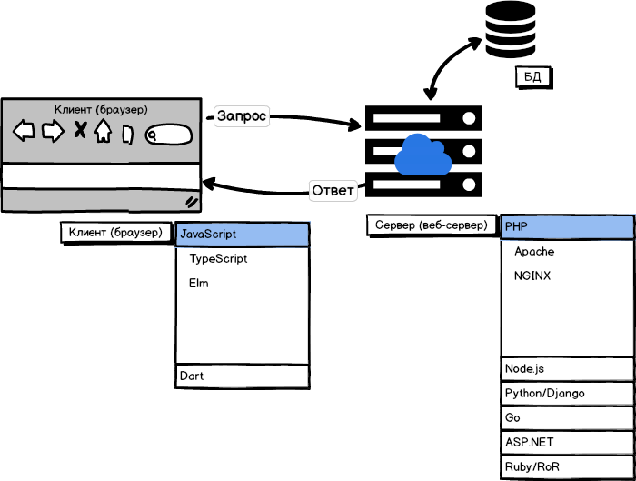

# Веб-теория

Что такое веб? Какую роль играет схема взаимодействия «клиент-сервер» ?




Что объединяет и разделяет PHP и JavaScript?

---

Сравните:


```PHP
<ol>
<?php
    $num = 5;
    for ($i=1; $i<=$num; $i++) {
        echo '<li>Элемент номер ' . $i  . '</li>';
    }
?>
</ol>
```
и
```JavaScript
<ol>
<script>{
  $num = 5;
  for ($i=1; $i<=$num; $i++) {
     document.write( '<li>Элемент номер ' + $i + '</li>');                   
  }
}</script>
</ol> 
```

- https://kodaktor.ru/bc67765_04625
- https://kodaktor.ru/bc67765_5d716
- https://kodaktor.ru/bc67765_16a49
- https://kodaktor.ru/bc67765

---
В проекте kodent адрес https://php-study1-gossoudarev.c9users.io/kurs2017/goss/1.php означает что файл находится по адресу `/home/ubuntu/workspace/kurs2017/goss/1.php`

---

Что такое LAMP? XAMPP? Open Server?

---

Запускаем скейлет LAMP на vscale.io

```bash
/var/www/html# mv index.html index.php
echo '<h1><?php echo date("r"); ?></h1>' > index.php
```


---

Что такое протокол HTTP? Что такое URL-кодирование? https://kodaktor.ru/g/urlcode 


---
Задание z1

z1 вывод времени

выведите с помощью date_default_timezone_set и date дату в формате

13/12/2017 15:50 


---
Задание z2

Вывод юникод-символов


---
Задание z3

Приветствие


---
Задание z4

Вычисление степени a ** b по GET-параметрам a и b


