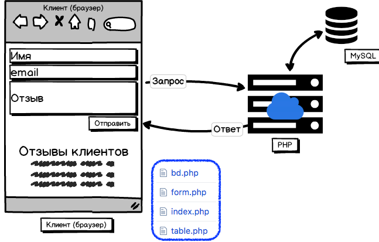

# PHP: Работа с БД
 
17.01.2018 
 

Создадим приложение «Книга отзывов» ("Reviews"):



с использованием БД MySQL.

При работе с заранее подготовленной БД используйте логины user1, user2, user3 и user4.


Обратите внимание на
```php
$conn -> exec('SET CHARACTER SET utf8');
```
